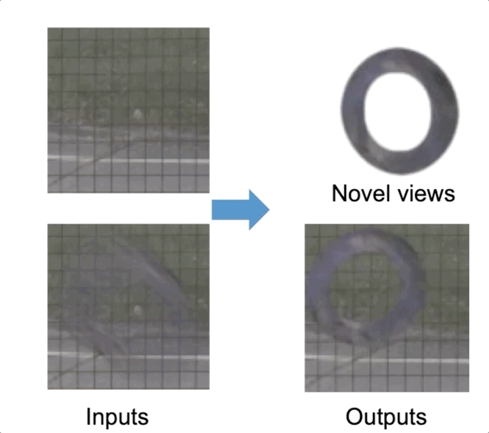
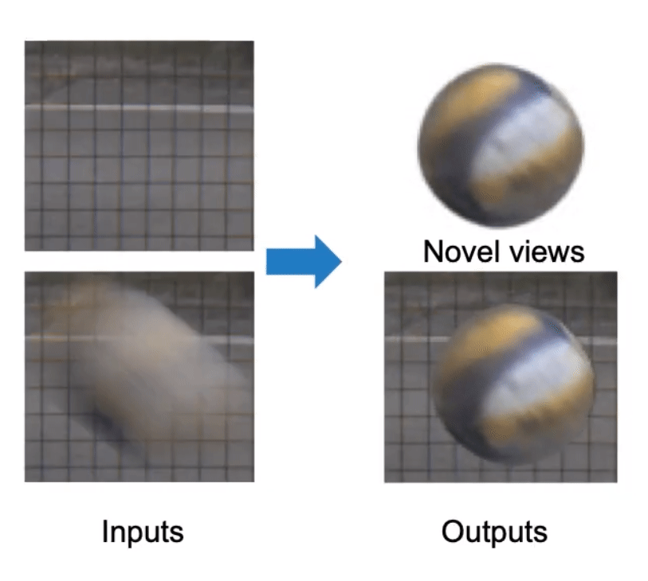
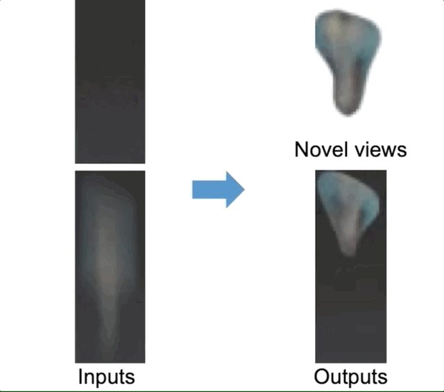
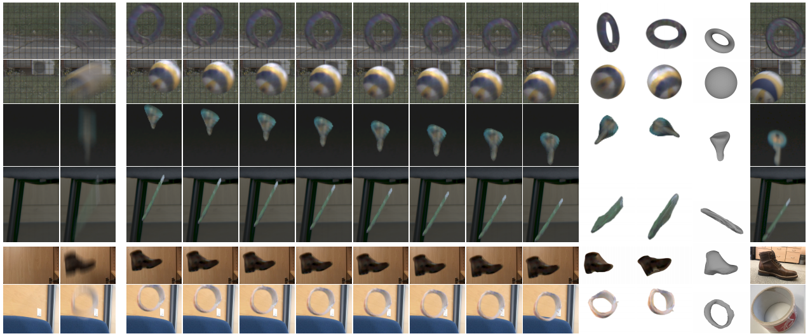
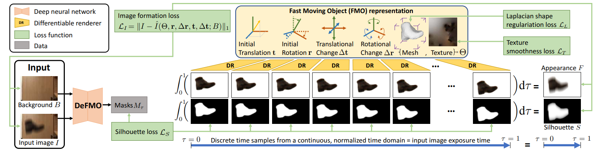

## Shape from Blur: Recovering Textured 3D Shape and Motion of Fast Moving Objects
### [YouTube](https://youtu.be/hPYWh9KGiu8) | [arXiv](https://arxiv.org/abs/2106.08762)

 &nbsp;&nbsp;&nbsp;&nbsp;&nbsp;&nbsp;   &nbsp;&nbsp;&nbsp;&nbsp;&nbsp;&nbsp;  &nbsp;&nbsp;&nbsp;&nbsp;&nbsp;&nbsp;  

### Prerequisites 
Make sure to download the submodule: official open-source DeFMO implementation: https://github.com/rozumden/DeFMO.
Please, also set up the DeFMO pre-trained models in main_settings.py by setting the variable g_saved_models_folder.

Kaolin is available here: https://github.com/NVIDIAGameWorks/kaolin


### Running


The code can be easily run by:
```bash
python optimize.py
```

Running with your inputs:
```bash
python optimize.py --im examples/vol_im.png --bgr examples/vol_bgr.png
python optimize.py --im examples/aerobie_im.png --bgr examples/aerobie_bgr.png
python optimize.py --im examples/pen_im.png --bgr examples/pen_bgr.png
```

The results will be written to the output folder.

Reference
------------

If you use this repository, please cite the following [publication](https://arxiv.org/abs/2012.00595):

```bibtex
@misc{sfb,
  title = {Shape from Blur: Recovering Textured 3D Shape and Motion of Fast Moving Objects},
  author = {Denys Rozumnyi and Martin R. Oswald and Vittorio Ferrari and Marc Pollefeys},
  year = {2021},
  eprint = {2106.08762},
  archivePrefix = {arXiv},
  primaryClass = {cs.CV}
}
```
